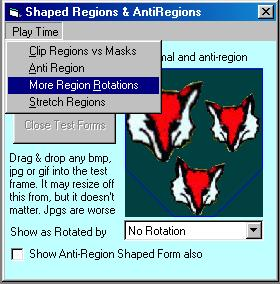



## FYI: Fun with Regions

### Description

A compilation of region functions & examples. Included is probably the fastest window shaping routine on PSC. Regions used to create shaped windows, regions used for simple animation, rotating & stretching regions, and using regions similar to FloodFill are examples shown. All are heavily commented to assist in learning.
 
### More Info
 

             |
---                |---
**Submitted On**   |2005-01-16 18:58:02
**By**             |[LaVolpe](https://github.com/Planet-Source-Code/PSCIndex/blob/master/ByAuthor/lavolpe.md)
**Level**          |Advanced
**User Rating**    |4.7 (90 globes from 19 users)
**Compatibility**  |VB 6\.0
**Category**       |[Graphics](https://github.com/Planet-Source-Code/PSCIndex/blob/master/ByCategory/graphics__1-46.md)
**World**          |[Visual Basic](https://github.com/Planet-Source-Code/PSCIndex/blob/master/ByWorld/visual-basic.md)
**Archive File**   |[FYI\_\_Fun\_w1840571162005\.zip](https://github.com/Planet-Source-Code/lavolpe-fyi-fun-with-regions__1-58319/archive/master.zip)

